## 前言

**环境**

- Pixel 4
- Android 11

网上trace smali的文章有不少，大多都需要改源码编译ROM，比较麻烦，而且主要是在较低版本实现的

于是想写个能够直接frida一步到位的脚本，正好也学习了一些知识，在断断续续弄了一段时间后，终于达到一个相对满意的程度

---

本文是结合脱壳王课程中的【使用frida调试ART下的解释器】详细实践

目标是以尽可能通用的手段实现对smali执行记录，无需修改ROM，也不用强制APP运行在switch模式下

---

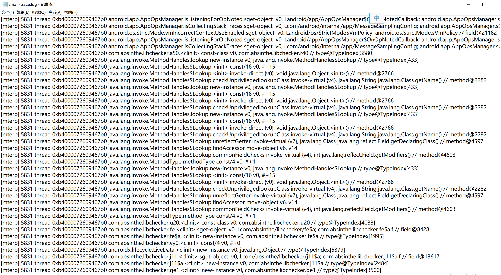

## 实现过程

### 准备工作

提取手机中的`libart.so`，这里是用64位的，用IDA打开分析

```bash
adb pull /apex/com.android.art/lib64/libart.so
```

关于smali执行入口这些就不详细分析了，具体请查看下面的文章：

- https://bbs.pediy.com/thread-263210.htm

也可检索下面几个关键词查更多的资料：

- `TraceExecution`
- `ExecuteSwitchImplCpp`
- `ExecuteSwitchImpl`
- `ExecuteMterpImpl`

### 如何打印函数和指令

分析`TraceExecution`的代码可以知道，要打印smali指令详细内容，其实只要这两句即可

- `shadow_frame.GetMethod()->PrettyMethod()`
- `inst->DumpString(shadow_frame.GetMethod()->GetDexFile())`

```c++
static inline void TraceExecution(const ShadowFrame& shadow_frame, const Instruction* inst,
                                const uint32_t dex_pc)
    REQUIRES_SHARED(Locks::mutator_lock_) {
if (kTraceExecutionEnabled) {
#define TRACE_LOG std::cerr
    std::ostringstream oss;
    oss << shadow_frame.GetMethod()->PrettyMethod()
        << android::base::StringPrintf("\n0x%x: ", dex_pc)
        << inst->DumpString(shadow_frame.GetMethod()->GetDexFile()) << "\n";
    for (uint32_t i = 0; i < shadow_frame.NumberOfVRegs(); ++i) {
    uint32_t raw_value = shadow_frame.GetVReg(i);
    ObjPtr<mirror::Object> ref_value = shadow_frame.GetVRegReference(i);
    oss << android::base::StringPrintf(" vreg%u=0x%08X", i, raw_value);
    if (ref_value != nullptr) {
        if (ref_value->GetClass()->IsStringClass() &&
            !ref_value->AsString()->IsValueNull()) {
        oss << "/java.lang.String \"" << ref_value->AsString()->ToModifiedUtf8() << "\"";
    } else {
        oss << "/" << ref_value->PrettyTypeOf();
    }
    }
}
TRACE_LOG << oss.str() << "\n";
#undef TRACE_LOG
}
}
```

在IDA中搜索`PrettyMethod`，导出符号是`_ZN3art9ArtMethod12PrettyMethodEPS0_b`，IDA显示是三个参数，但只需要传两个即可

（这个应该是反编译的一种约定？

第二个参数是bool类型，用来决定是否输出参数部分，这里建议false

```c
__int64 __fastcall art::ArtMethod::PrettyMethod(art::ArtMethod *__hidden this, art::ArtMethod *, bool)
```

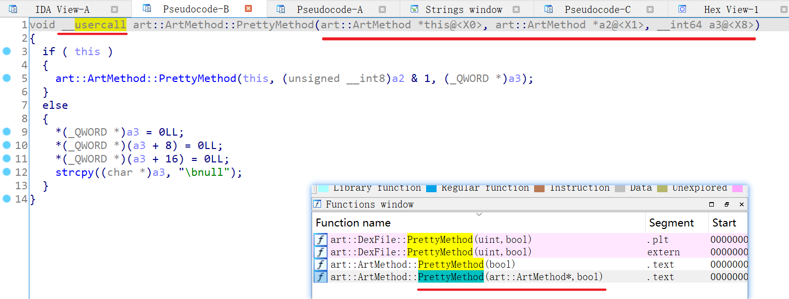

可以看到里面又调用了一个`PrettyMethod`，符号是`_ZN3art9ArtMethod12PrettyMethodEb`

- http://aospxref.com/android-11.0.0_r21/xref/art/runtime/art_method.cc#813

为了减少判断，这里选后面这个，代码如下：

```JavaScript
function get_PrettyMethod(){
    let PrettyMethod_ptr =  Module.findExportByName("libart.so", "_ZN3art9ArtMethod12PrettyMethodEb");
    if (PrettyMethod_ptr == null){
        log(`libart.so PrettyMethod_ptr is null`);
        return;
    }
    log(`PrettyMethod_ptr => ${PrettyMethod_ptr}`);
    let PrettyMethod_func = new NativeFunction(PrettyMethod_ptr, ["pointer", "pointer", "pointer"], ["pointer", "bool"]);
    return PrettyMethod_func;
}
```

返回结果是`std::string`，查找资料可知不管是大端还是小端，都是三个指针构成，所以返回类型写成`["pointer", "pointer", "pointer"]`

调用的时候第二个参数类型是bool，但实际应该传入一个数字，`1`为`true`，`0`为`false`

frida如何读取`std::string`的具体字符串？

综合各路信息，脚本一般如下：

```JavaScript
function readStdString(pointers: NativePointer[]) {
    let str = Memory.alloc(Process.pointerSize * 3);
    str.writePointer(pointers[0]);
    str.add(Process.pointerSize * 1).writePointer(pointers[1]);
    str.add(Process.pointerSize * 2).writePointer(pointers[2]);
    let isTiny = (str.readU8() & 1) === 0;
    if (isTiny) {
        return str.add(1).readUtf8String();
    }
    return str.add(2 * Process.pointerSize).readPointer().readUtf8String();
}
```

为了减少写数据操作，改进如下：

```JavaScript
function readStdString(pointers: NativePointer[]){
    let str = Memory.alloc(Process.pointerSize * 3);
    str.writePointer(pointers[0]);
    let isTiny = (str.readU8() & 1) === 0;
    if (isTiny) {
        str.add(Process.pointerSize * 1).writePointer(pointers[1]);
        str.add(Process.pointerSize * 2).writePointer(pointers[2]);
        return str.add(1).readUtf8String();
    }
    else{
        return pointers[2].readUtf8String();
    }
}
```

于是打印函数签名如下：

```JavaScript
function PrettyMethod(art_method_ptr: NativePointer){
    let results: NativePointer[] = PrettyMethod_func(art_method_ptr, 0);
    return readStdString(results);
}
```

接下来是打印指令信息

```c++
inst->DumpString(shadow_frame.GetMethod()->GetDexFile())
```

根据代码可知，如果要调用系统函数打印，那么需要两个参数：

- inst 即 Instruction
- shadow_frame 即 ShadowFrame

`DumpString`函数符号`_ZNK3art11Instruction10DumpStringEPKNS_7DexFileE`，位于`libdexfile.so`

Q: 假设拿到了`shadow_frame`，那`shadow_frame.GetMethod()`该如何写呢？

A: C/C++中这种访问私有成员的操作，在编译后会变成通过偏移取值，所以要分析对应的偏移是多少。

- http://aosp.opersys.com/xref/android-11.0.0_r47/xref/art/runtime/interpreter/shadow_frame.h#426

具体C/C++中内存布局是怎样的，还请自行了解（我也不敢说懂...）

结合实际情况与IDA反汇编结果分析，得到64位下，`ShadowFrame`的大小占用如下（部分）：

```c++
pointer ShadowFrame* link_;
pointer ArtMethod* method_;
pointer JValue* result_register_;
pointer const uint16_t* dex_pc_ptr_;
pointer const uint16_t* dex_instructions_;
pointer LockCountData lock_count_data_;
4 const uint32_t number_of_vregs_;
4 uint32_t dex_pc_;
2 int16_t cached_hotness_countdown_;
2 int16_t hotness_countdown_;
```

- `pointer`指的是一个指针大小，在64位上那么就是8字节
- `uint16_t*` 指的是该指针对应位置的对象，是`uint16_t`类型的，千万不要理解成指针是`uint16_t`大小；指针的大小由系统架构决定

那么`shadow_frame.GetMethod()`用frida写就是下面这样

```JavaScript
let art_method_ptr = shadow_frame_ptr.add(Process.pointerSize).readPointer();
```

结合IDA反汇编结果分析，以及前人经验，`ArtMethod`的大小占用如下（部分）：

```c++
4 GcRoot<mirror::Class> declaring_class_;
4 std::atomic<std::uint32_t> access_flags_;
4 uint32_t dex_code_item_offset_;
4 uint32_t dex_method_index_;
2 uint16_t method_index_;
```

那么`GetDexFile()`具体怎么取的呢？结合源代码与IDA反汇编结果共同分析，计算如下

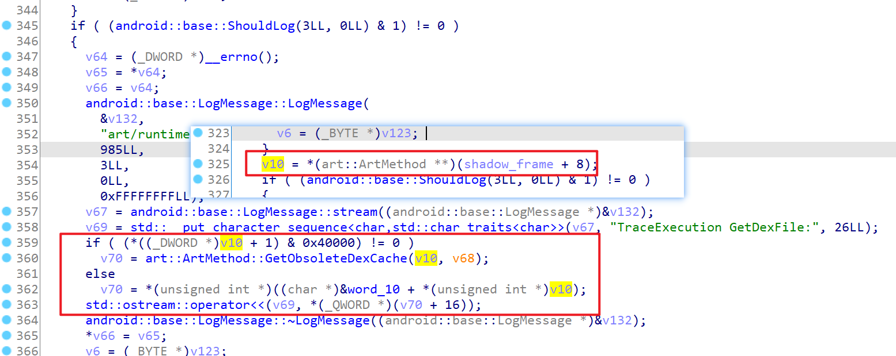

```JavaScript
GetDexFile(): NativePointer {
    let access_flags = this.pointer.add(0x4).readU32();
    // IsObsolete() => (GetAccessFlags() & kAccObsoleteMethod) != 0;
    if ((access_flags & 0x40000) != 0){
        log(`flag => ${access_flags}`);
        return this.GetObsoleteDexCache();
    }
    else{
        let declaring_class_ptr = ptr(this.pointer.readU32());
        let dex_cache_ptr = ptr(declaring_class_ptr.add(0x10).readU32());
        let dex_file_ptr = dex_cache_ptr.add(0x10).readPointer();
        return dex_file_ptr;
    }            
}
```

其中`GetObsoleteDexCache`好像还需要一个参数？不过实际使用中没有出现过进入需要`GetObsoleteDexCache()`的分支，暂时不管了...

```JavaScript
// __int64 __fastcall art::ArtMethod::GetObsoleteDexCache(art::ArtMethod *__hidden this)
function get_GetObsoleteDexCache(){
    let GetObsoleteDexCache_ptr =  Module.findExportByName("libart.so", "_ZN3art9ArtMethod19GetObsoleteDexCacheEv");
    if (GetObsoleteDexCache_ptr == null){
        log(`libart.so GetObsoleteDexCache_ptr is null`);
        return;
    }
    log(`GetObsoleteDexCache_ptr => ${GetObsoleteDexCache_ptr}`);
    let GetObsoleteDexCache_func = new NativeFunction(GetObsoleteDexCache_ptr, "pointer", ["pointer"]);
    return GetObsoleteDexCache_func;
}
```

看到上面的代码可能会有疑问，`ArtMethod`里面`declaring_class_`的类型不是`GcRoot<mirror::Class>`吗

怎么是4字节？呜呜呜我对C++也不熟，但根据IDA反汇编的结果来看确实是4字节，而且在网上查到的其他结构信息也是uint32_t

根据分析，`GetDexFile()`的调用过程如下：

- 先获取`ArtMethod`的`declaring_class_`，类型是`Class`
    - http://aosp.opersys.com/xref/android-11.0.0_r47/xref/art/runtime/mirror/class.h#82
- 再取`dex_cache_`，类型是`DexCache`
    - http://aosp.opersys.com/xref/android-11.0.0_r47/xref/art/runtime/mirror/dex_cache.h#133
- 最后取`dex_file_`

相关的类成员结构如下（部分）：

```c++
// art/runtime/mirror/class.h
HeapReference<ClassLoader> class_loader_;
HeapReference<Class> component_type_;
HeapReference<DexCache> dex_cache_;
HeapReference<ClassExt> ext_data_;
```

```c++
// runtime/mirror/dex_cache.h
HeapReference<ClassLoader> class_loader_;
HeapReference<String> location_;
uint64_t dex_file_;
uint64_t preresolved_strings_;
```

好了，现在`shadow_frame.GetMethod()->GetDexFile()`总算是完成了

`DumpString`的第一个参数就是`Instruction`，也就是还需要拿到`inst`

根据`ExecuteSwitchImplCpp`的代码可以知道，需要下面这几步

```c++
uint32_t dex_pc = shadow_frame.GetDexPC();
const uint16_t* const insns = accessor.Insns();
const Instruction* next = Instruction::At(insns + dex_pc);
```

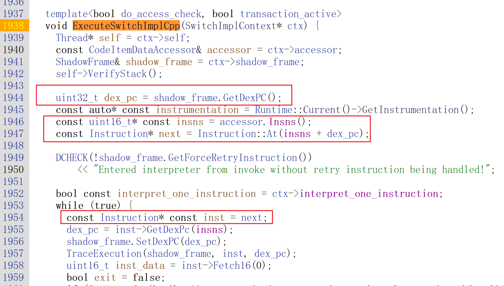

`GetDexPC()`代码如下：

```c++
uint32_t GetDexPC() const {
  return (dex_pc_ptr_ == nullptr) ? dex_pc_ : dex_pc_ptr_ - dex_instructions_;
}
```

有了前面的经验，很快就能写出下面的frida代码，其中`this.pointer`是`ShadowFrame`指针

```JavaScript
GetDexPC(): number {
    let dex_pc_ptr_ = this.pointer.add(Process.pointerSize * 3).readPointer();
    if (!dex_pc_ptr_.equals(ptr(0x0))){
        let dex_instructions_ = this.pointer.add(Process.pointerSize * 4).readPointer();
        return Number(dex_pc_ptr_.sub(dex_instructions_).toString());
    }
    else{
        return this.pointer.add(Process.pointerSize * 6 + 4).readU32();
    }
}
```

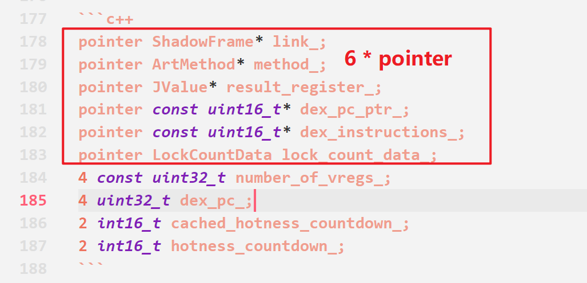

其实对于刚进入`ExecuteSwitchImplCpp`时，`dex_pc`一定是`0`（应该没错）

所以`Instruction::At(insns + dex_pc)`最终其实就是取`insns`指针，不过为了通用一些，还是实现具体点

而`accessor.Insns()`也是类似的，先从`SwitchImplContext`取`accessor`，再取`insns_`偏移即可

现在再传入调用`DumpString`即可打印smali指令

### 在何处打印指令

根据已有信息可知，解释模式下必定经过`ExecuteSwitchImplCpp`，汇编模式下必定经过`ExecuteMterpImpl`

`ExecuteSwitchImplCpp`是一个函数模板，其调用来自于`ExecuteSwitchImpl`

```c++
template<bool do_access_check, bool transaction_active>
ALWAYS_INLINE JValue ExecuteSwitchImpl(Thread* self, const CodeItemDataAccessor& accessor,
                                       ShadowFrame& shadow_frame, JValue result_register,
                                       bool interpret_one_instruction)
  REQUIRES_SHARED(Locks::mutator_lock_) {
  SwitchImplContext ctx {
    .self = self,
    .accessor = accessor,
    .shadow_frame = shadow_frame,
    .result_register = result_register,
    .interpret_one_instruction = interpret_one_instruction,
    .result = JValue(),
  };
  void* impl = reinterpret_cast<void*>(&ExecuteSwitchImplCpp<do_access_check, transaction_active>);
  const uint16_t* dex_pc = ctx.accessor.Insns();
  ExecuteSwitchImplAsm(&ctx, impl, dex_pc);
  return ctx.result;
}
```

- http://aosp.opersys.com/xref/android-11.0.0_r47/xref/art/runtime/arch/arm64/quick_entrypoints_arm64.S

根据源代码可知`ExecuteSwitchImplCpp`参数是`SwitchImplContext`

- http://aosp.opersys.com/xref/android-11.0.0_r47/xref/art/runtime/interpreter/interpreter_switch_impl-inl.h#1938


于是可以遍历`libart.so`的所有符号，找到带有`ExecuteSwitchImplCpp`关键字的符号，进行hook

然后解析`SwitchImplContext`参数，拿到`shadow_frame`和`inst`即可

`shadow_frame`可以直接通过`SwitchImplContext`拿到

而汇编模式的入口函数`ExecuteMterpImpl`则直接有`inst`和`shadow_frame`，那更加简单了

那么hook代码如下：

```JavaScript
function trace_interpreter_enrty(libart: Module, hook_switch: boolean, hook_mterp: boolean){
    libart.enumerateSymbols().forEach(function(symbol: ModuleSymbolDetails){
        let name = symbol.name;
        let address = symbol.address;
        if(name.includes("ExecuteSwitchImplCpp") && hook_switch){
            log(`start hook ${name}`);
            Interceptor.attach(address, {
                onEnter(args) {
                    let ctx = new SwitchImplContext(args[0]);
                    let shadow_frame = ctx.shadow_frame;
                    let method_key = shadow_frame.method.toString();
                    let method_name: any = method_name_cache[method_key];
                    if (!method_name){
                        method_name = shadow_frame.method.PrettyMethod();
                        if (method_name){
                            method_name_cache[method_key] = method_name;
                        }
                    }
                    let dexfile_ptr = shadow_frame.method.GetDexFile();
                    let dex_pc = shadow_frame.GetDexPC();
                    // const Instruction* next = Instruction::At(insns + dex_pc);
                    let inst_ptr = ctx.accessor.insns.add(dex_pc);
                    let inst_str = PrettyInstruction(inst_ptr, dexfile_ptr);
                    log(`[switch] ${Process.getCurrentThreadId()} ${method_name} ${inst_str}`);
                }
            });
        }
        if(name.includes("ExecuteMterpImpl") && hook_mterp){
            log(`start hook ${name}`);
            Interceptor.attach(address, {
                onEnter(args) {
                    let inst_ptr = args[1];
                    let shadow_frame = new ShadowFrame(args[2]);
                    let method_name = get_method_name(shadow_frame);
                    let dexfile_ptr = shadow_frame.method.GetDexFile();
                    let inst_str = PrettyInstruction(inst_ptr, dexfile_ptr);
                    log(`[mterp] ${Process.getCurrentThreadId()} thread ${args[0]} ${method_name} ${inst_str}`);
                }
            });
        }
    })
}
```

至此已经初步实现了smali指令trace了，为设么说是【初步】呢？

因为这两个函数仅仅是入口，也就是说进入一个函数后，函数内具体要执行的指令这个位置是打印不出来的

所以到这里只能追踪一部分代码的自行情况，不过只看执行流程的话已经差不多够了

要具体到每一条指令做了什么，那需要找到具体位置，比如switch模式下会判断每条指令的opcode，然后跳转到具体分支执行

而mterp模式下，进入`ExecuteMterpImpl`后，会计算出要执行指令的opcode，然后通过`BR`指令直接跳转执行

执行后立刻计算下一个opcode，再跳转对应的汇编位置，直到全部指令执行完成

### 详细打印switch模式下执行的指令

结合源代码，很快啊，就分析出来最佳hook位置是这刚进入while循环的地方

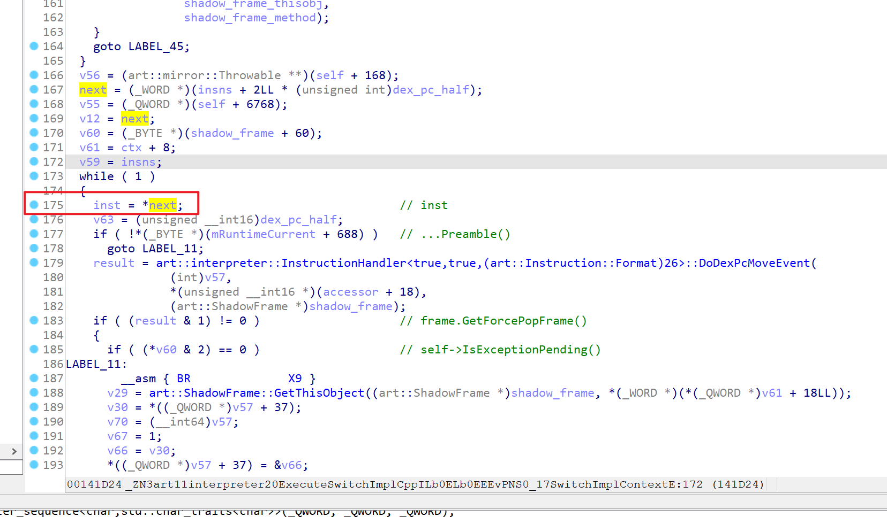

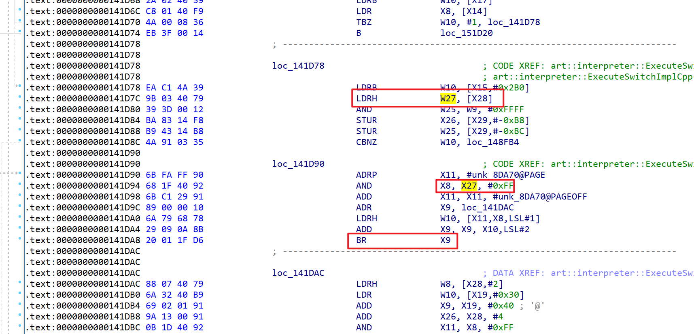

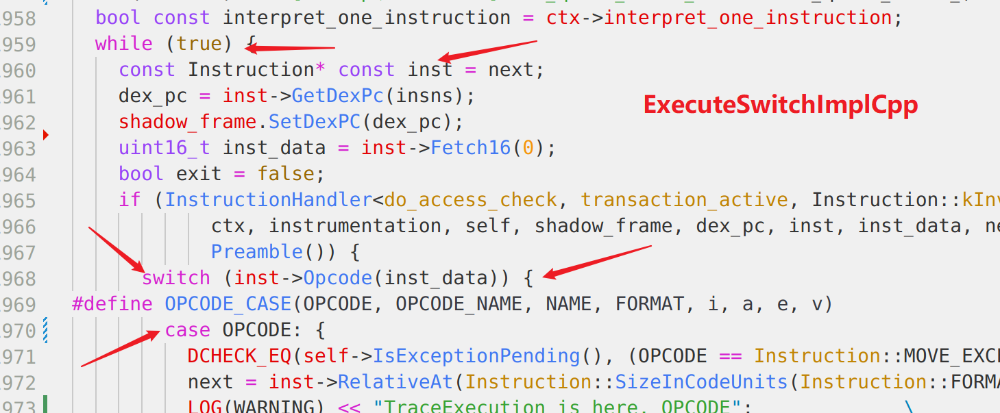

但是新的问题又出现了，怎么拿到`shadow_frame`和`inst`呢？

`inst`好说，因为while这里赋值的就是`inst`，直接取对应寄存器即可

`shadow_frame`就不好说了，我决定将这个位置所有的寄存器都打印下，然后把前面hook的`ExecuteSwitchImplCpp`拿到的`shadow_frame`打印出来，找找规律

毕竟是挨着的，理论上应该是相同的（应该没错）

反复确认，这个寄存器就是`x19`，然后看了下汇编，原来早函数开始的位置就给x19了，后面也没有改变过

如果是新的`shadow_frame`，那应该新调用`ExecuteSwitchImplCpp`？


对了，`ExecuteSwitchImplCpp`是函数模板，编译的时候`do_access_check`和`transaction_active`都是确定值

- `template<bool do_access_check, bool transaction_active>`

所以实际上解释模式只会调用四个中的一个，打印一下调用的哪个，然后只需要找到这一个的switch判断位置即可

于是hook代码编写如下：

```JavaScript
// trace_interpreter_switch(libart, 0x169EB4, 'x19', 'x26');
function trace_interpreter_switch(libart: Module, offset: number, frame_reg: string, inst_reg: string) {
    Interceptor.attach(libart.base.add(offset), {
        onEnter(args) {
            let id = switch_count;
            switch_count += 1;
            let ctx = this.context as Arm64CpuContext;
            let shadow_frame = new ShadowFrame(ctx[frame_reg as keyof typeof ctx]);
            // 通过 thread 获取到当前的 shadow_frame
            // let thread_ptr = ctx.sp.add(0x210).sub(0x168).readPointer();
            // let shadow_frame = get_shadow_frame_ptr_by_thread_ptr(thread_ptr);
            let method_name = get_method_name(shadow_frame);
            let dexfile_ptr = shadow_frame.method.GetDexFile();
            let inst_ptr = ctx[inst_reg as keyof typeof ctx];
            let inst_str = PrettyInstruction(inst_ptr, dexfile_ptr);
            log(`[${id}] [switch] ${method_name} ${inst_str}`);
        }
    });
}
```

这里`get_shadow_frame_ptr_by_thread_ptr`是什么？

这是因为在`mterp`模式下确实拿不到`shadow_frame`，后来翻阅源代码后，发现可以通过`thread`拿到当前的`shadow_frame`

具体下一个小节说明，这里除了通过测试来确定哪个寄存器是`shadow_frame`，还可以结合反汇编代码分析

可以知道`thread`被放到栈帧中了，于是也可以通过`sp`拿到`thread`指针，再去获取`shadow_frame`

### 详细打印mterp模式下执行的指令

先看`ExecuteMterpImpl`，啊这...显然它会跳转到其他位置进行具体的指令执行


而寄存器`x20`显然就是`inst`，这里的`shadow_frame`根据汇编也能找到具体寄存器

但是这里并没有执行指令，本质上和开始做`ExecuteMterpImpl`的hook效果是一样的

要具体追踪执行了什么指令，那么得到每个opcode的处理位置去hook

怎么确定位置呢，冰冰老师的方案是根据指令特征，在内存中直接搜索对应的指令，然后去hook对应的位置

每一次计算opcode以及跳转都是下面的指令

```bash
.text:000000000012A0D4 97 02 40 79    LDRH    W23, [X20]
.text:000000000012A0D8 F0 1E 40 92    AND     X16, X23, #0xFF
.text:000000000012A0DC 10 1F 10 8B    ADD     X16, X24, X16,LSL#7
.text:000000000012A0E0 00 02 1F D6    BR      X16
```

不过我发现mterp相关的opcode处理位置的符号是被保留了的（高版本，Android 10和Android 11上是这样的）

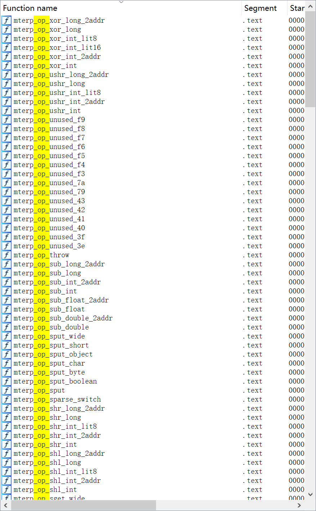

很快啊，就能写出下面的代码，直接找到符号，然后执行hook，经过实践有几个注意点：

- `_helper`和`_quick`结尾的实际上是某些opcode处理的分支，不需要hook
- `mterp_op_return_void_no_barrier`也不是`return`指令的具体处理位置，只是处理分支，跳过hook
- `unused`没有任何处理，跳过hook（预留的指令）
- `mterp_op_nop`的指令很短，使用frida hook不了，会出现异常，需要跳过hook

```bash
.text:000000000012A100    mterp_op_nop        ; DATA XREF: .got:mterp_op_nop_ptr↓o
.text:000000000012A100        LDRH            W23, [X20,#2]!
.text:000000000012A104        AND             X16, X23, #0xFF
.text:000000000012A108        ADD             X16, X24, X16,LSL#7
.text:000000000012A10C        BR              X16
.text:000000000012A10C    ; End of function mterp_op_nop
```

- `mterp_op_return`起始的处理函数，它们的第一个指令是BL，经过验证frida hook会出错，需要把hook位置加4

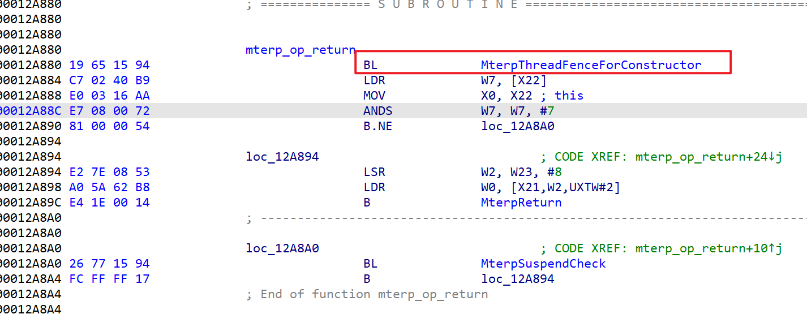

那么可以编写hook代码如下：

```JavaScript
function trace_interpreter_mterp_op(libart: Module, thread_reg: string, inst_reg: string) {
    let op_count = 0;
    let symbols = libart.enumerateSymbols();
    for (let index = 0; index < symbols.length; index++) {
        const symbol = symbols[index];
        // 过滤不符合要求的符号
        if (!symbol.name.startsWith("mterp_op_")) continue;
        if (symbol.name.endsWith("_helper")) continue;
        if (symbol.name.endsWith("_quick")) continue;
        if (symbol.name.endsWith("_no_barrier")) continue;
        if (symbol.name.includes("unused")) continue;
        // nop 对应位置的指令太短 hook 会失败 跳过
        if (symbol.name == "mterp_op_nop") continue;
        op_count += 1;
        let hook_addr = symbol.address;
        // return 相关的指令起始就是一个BL frida hook 会失败 需要把hook点向后挪4字节
        if (symbol.name.startsWith("mterp_op_return")) {
            hook_addr = symbol.address.add(0x4);
        }
        let offset = hook_addr.sub(libart.base);
        log(`[mterp_op] ${symbol.name} ${symbol.address} ${hook_addr} ${offset}`);
        // 正式 hook
        hook_mterp_op(hook_addr, offset, thread_reg, inst_reg);
    }
    log(`[mterp_op] op_count ${op_count}`);
}
```

在每个opcode对应的hook位置，我们都能确定`inst`是哪个寄存器（并且是固定的），因为每次都需要取下一条opcode，所以必须用到`inst`

再次出现前面的问题，怎么拿到`shadow_frame`，这回我尝试对比每个寄存器，发现并不存在一个寄存器始终存放`shadow_frame`

并且根据汇编代码也没有发现`shadow_frame`被放入栈帧中

好在通过阅读源代码，发现一个名为`GetCurrentShadowFrame`的函数

取的是类`StackVisitor`的`cur_shadow_frame_`成员

经过进一步分析，发现可以通过下面两步得到`cur_shadow_frame_`

```c++
const ManagedStack* current_fragment = thread_->GetManagedStack();
ShadowFrame* cur_shadow_frame_ = current_fragment->GetTopShadowFrame();
```

`cur_shadow_frame_`的偏移比较好计算，就是偏移两个指针大小就行，如下

```c++
// runtime/stack.h StackVisitor 类
Thread* const thread_;
const StackWalkKind walk_kind_;
ShadowFrame* cur_shadow_frame_;
ArtMethod** cur_quick_frame_;
uintptr_t cur_quick_frame_pc_;
```

但是`managed_stack`在`Thread`中的偏移就比较麻烦了，主要是因为`Thread`比较复杂

经过一番查阅后，发现在`art::StackVisitor::WalkStack`里面有调用`GetManagedStack()`

- `void art::StackVisitor::WalkStack<(art::StackVisitor::CountTransitions)0>(bool)`

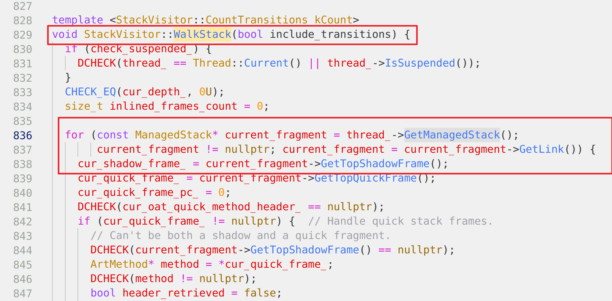

并且这个函数的符号还在，于是结合源代码，和IDA对比便能知道`GetManagedStack()`实际的偏移

注意这个偏移每个版本、手机的可能都不同，比如我这里是`184`也就是`0xB8`

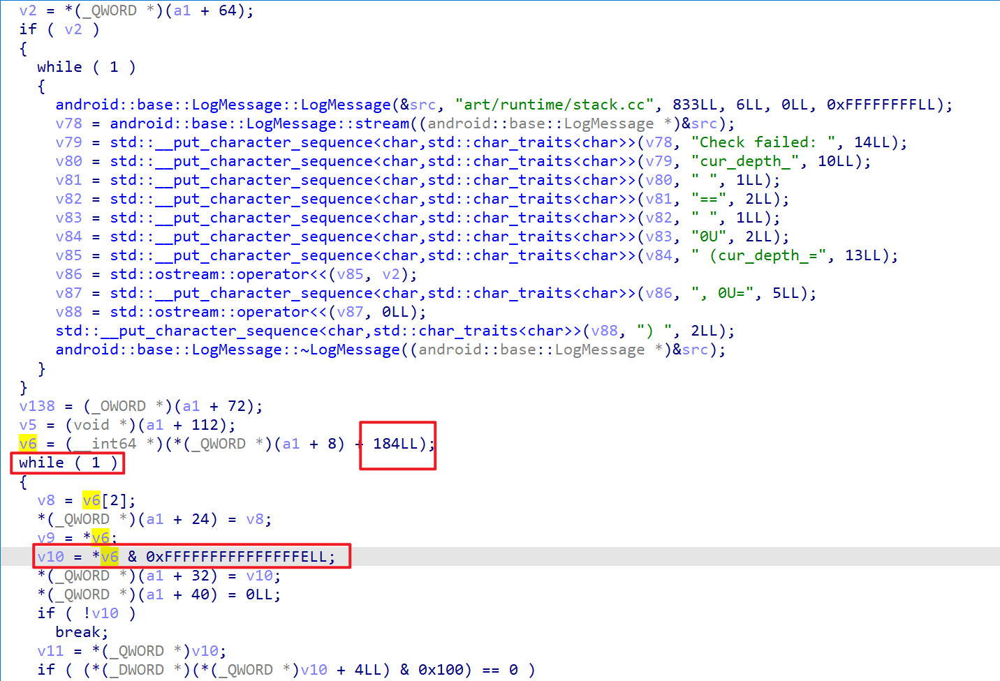

于是编写hook代码如下，用于通过`thread`计算`shadow_frame`

```JavaScript
function get_shadow_frame_ptr_by_thread_ptr(thread_ptr: NativePointer) : ShadowFrame {
    // 0xB8 是 managed_stack 在 Thread 中的偏移 需要结合IDA分析
    // 如何定位这个偏移
    // void art::StackVisitor::WalkStack<(art::StackVisitor::CountTransitions)0>(bool)
    // _ZN3art12StackVisitor9WalkStackILNS0_16CountTransitionsE0EEEvb
    // 找到这个函数 然后反编译 在开头找到一个 与 0xFFFFFFFFFFFFFFFELL 相与的变量
    // 然后回溯 可以发现它时由传入参数通过偏移取指针再偏移 这个就是 managed_stack 的偏移
    // http://aospxref.com/android-11.0.0_r21/xref/art/runtime/stack.cc#835
    let managed_stack = thread_ptr.add(0xB8);
    // 0x10 是 top_shadow_frame_ 在 ManagedStack 中的偏移 结合源码或者IDA可以分析出来
    let cur_frame_ptr = managed_stack.add(0x10).readPointer();
    return new ShadowFrame(cur_frame_ptr);
}
```

Q: 那么thread就一定能从寄存器获取到吗？

A: 经过验证，确实有一个寄存器在任何opcode操作位置执行的时候，其值为`thread`

我这里确定这个寄存器是`x22`，于是编写具体的hook代码如下

```JavaScript
function hook_mterp_op(address: NativePointer, offset: NativePointer, thread_reg: string, inst_reg: string) {
    Interceptor.attach(address, {
        onEnter(args) {
            let id = mterp_count;
            mterp_count += 1;
            let ctx = this.context as Arm64CpuContext;
            let thread_ptr = ctx[thread_reg as keyof typeof ctx];
            let shadow_frame = get_shadow_frame_ptr_by_thread_ptr(thread_ptr);
            let method_name = get_method_name(shadow_frame);
            let dexfile_ptr = shadow_frame.method.GetDexFile();
            let inst_ptr = ctx[inst_reg as keyof typeof ctx];
            let inst_str = PrettyInstruction(inst_ptr, dexfile_ptr);
            log(`[${id}] [mterp] ${Process.getCurrentThreadId()} ${method_name} ${inst_str}`);
        }
    });
}
```

`ExecuteMterpImpl`第一个参数就是`thread`，再去看汇编，可以看到`X0`给了`X22`，而经过打印验证，`X22`确实也没有改变（除非是不同的线程）

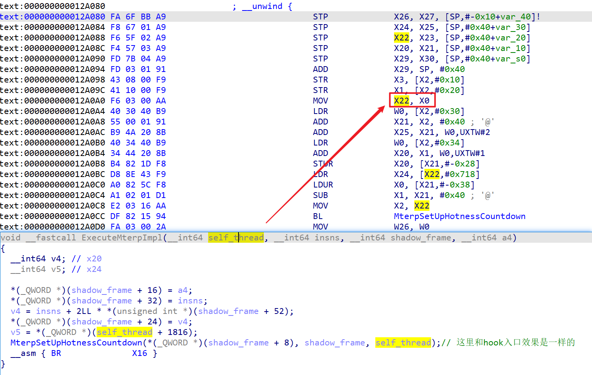

### 完整的hook脚本需要准备什么

经过一系列发分析，验证，现在要打印switch模式和mterp模式下smali指令的详细执行情况

最佳方案是：

- switch模式，找到哪个`ExecuteSwitchImplCpp`实现是当前系统调用的，然后根据

1. while特征
2. 取指针后和`0xFF`相与
3. BR跳转

这三个特征，定位到源代码中`ExecuteSwitchImplCpp`下面这个位置，然后在这里进行hook

```c++
while (true) {
    const Instruction* const inst = next;
    dex_pc = inst->GetDexPc(insns);
    // ...
}
```

随后通过IDA分析，或者打印`ExecuteSwitchImplCpp`入口处的`shadow_frame`，对比找到不变的寄存器，并确认是`shadow_frame`

然后就能详细打印switch模式下执行的具体指令了

- mterp模式，IDA静态分析`ExecuteMterpImpl`入口赋值，以及hook打印寄存器验证，确定`thread`是哪个寄存器

然后hook上mterp模式下每个opcode对应的处理位置，就能详细打印mterp模式下执行的具体指令了

## 补充事项

- 可能有的系统版本`ExecuteSwitchImplCpp`中进行switch判断，跳转opcode处理的分支的指令比较短，这个时候使用frida hook可能导致一些指令异常...
    - 这种情况建议手写一个inlinehook，尽可能减少指令占用，这样也许能成（我尝试了，但没有成功）
    - 参考资料：
        - https://github.com/GToad/Android_Inline_Hook_ARM64
        - https://gtoad.github.io/2018/09/20/Android-Native-Hook-Practice-Arm64/
        - https://github.com/AeonLucid/frida-syscall-interceptor
        - https://bbs.pediy.com/thread-268086.htm
    - 或者分析一下，具体每个case位置，看看能不能像mterp模式那种方法处理（mterp模式下只有nop的处理指令比较短，所以hook没啥问题）
- 系统有的时候使用switch模式执行代码，但大部分时候是mterp模式

- 可能有些部分我的理解有误，不一定正确，如果你发现了请指正（好像switch模式详细指令打印好像有重复）

## 链接

- https://bbs.pediy.com/thread-263210.htm
- http://aospxref.com/android-11.0.0_r21/xref/art/runtime/interpreter/interpreter.cc#247
- http://aospxref.com/android-11.0.0_r21/xref/art/runtime/interpreter/interpreter_switch_impl-inl.h#1938
- http://aospxref.com/android-11.0.0_r21/xref/art/runtime/interpreter/mterp/arm64/main.S#402